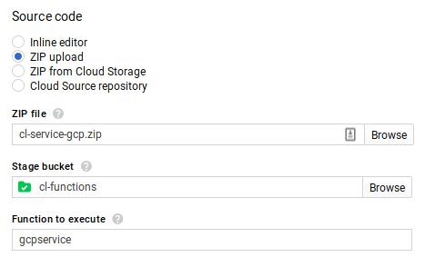
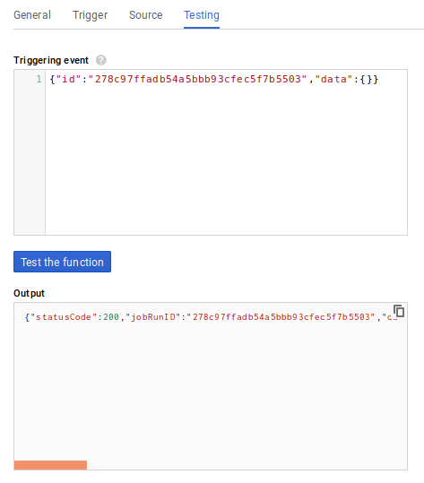

# General AWS Lambda External Adapter for Inserting API Keys

## Installing in AWS Lambda

- Upload `aws/cl-service-aws.zip` file
- Change Runtime to "Node.js 8.10"
- Handler should be index.handler


### Environment Variables

Add the following environment variables:

- `API_KEY_FIELD`: The value for the field name of the URL's API key
  - Example: in "?api_key=myapikey", "api_key" is the Value for this variable
- `API_KEY_VALUE`: The value for your actual API key
- `URL`: The full URL, minus the API query parameters, but including any additional parameters
  - Example: https://example.com/?language=en


### Testing in AWS Lambda

The results of the function should be parsed JSON, not a single-line string of JSON.


## Installing in Google Cloud Platform

- In `gcp/index.js`, update the values for `requestUrl`, `apiKeyField`, and `apiKeyValue`
- Install dependencies and zip the function:

```bash
$ cd gcp
$ npm install
$ zip -r cl-service-gcp.zip .
```

- Select Create Function in GCP Cloud Functions
- Use "Zip Upload" for the source code
- Upload `cl-service-gcp.zip` file.
- Create or use an existing Storage Bucket
- Function to execute: gcpservice



### Testing in Google Cloud Platform

You can provide the input data that the node would supply in order to simulate a JobRun in GCP. Use the following for input within Triggering event:

```JSON
{"id":"278c97ffadb54a5bbb93cfec5f7b5503","data":{}}
```



## Installing Locally

```bash
$ cd aws # or cd gcp
$ npm install
$ zip -r cl-service.zip .
```
