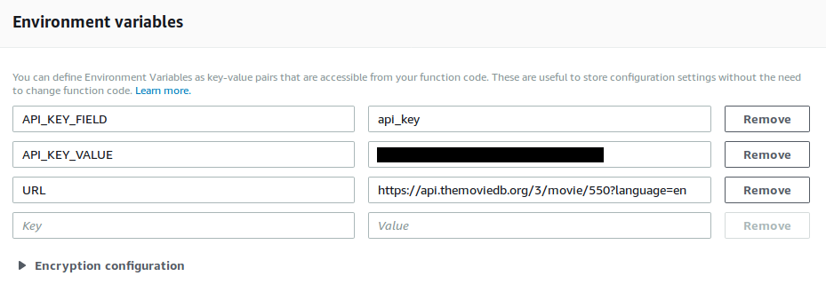

# General AWS Lambda External Adapter for Inserting API Keys

## Installing in AWS Lambda

- Upload `cl-service.zip` file
- Change Runtime to "Node.js 8.10"
- Handler should be index.handler


## Environment Variables

Add the following environment variables:

- `API_KEY_FIELD`: The value for the field name of the URL's API key
  - Example: in "?api_key=myapikey", "api_key" is the Value for this variable
- `API_KEY_VALUE`: The value for your actual API key
- `URL`: The full URL, minus the API query parameters, but including any additional parameters
  - Example: https://example.com/?language=en



## Output

The results of the function should be parsed JSON, not a single-line string of JSON.


## Installing Locally

```bash
$ npm install
$ zip -r cl-service.zip .
```
